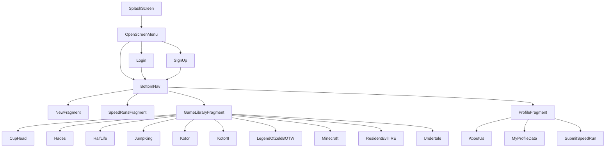

# GuideRunner

GuideRunner nevő projekt mobil alkalmazása.
Készítette: Deli Gábor

Backend:
https://github.com/paltsm/guiderunner

# Leírás:

Ez a dokumentáció egy a Java nyelven írott, Android Studióban kíszett mobil alkalmazás dokumentálását hivatott bemutatni.

# A projekt felépülése: 
  * Projekt sablonja (template) empty activity-re épül rá.
  * Target API : 31 ( A megcélzott API-szint azt jelzi, hogy az alkalmazás hogyan fut a	eltérő Android-verziókon.)
  * CompileSdk: 33 ( Megadja azt az API-szintet, amelyre a projektet le kell fordítani.)
  * MinSdk: 26
  * TargetSdk: 33
  
## Implementációk:
    ...
    ..
     'androidx.gridlayout:gridlayout:1.0.0'
       // Az Android GridLayout az elemek és nézetek téglalap alakú rács formájában történő megjelenítésére szolgál.
     
     'androidx.appcompat:appcompat:1.6.1'
      // Android-támogatási könyvtár, amely lehetővé teszi az ActionBar és a Material Design specifikus megvalósítását, 
      például az Eszköztár használatát a régebbi eszközökön egészen az Android v2-ig.
     
     'com.google.android.material:material:1.8.0'
      // Az Material Design átfogó útmutató a vizuális, mozgási és interakciós tervezéshez platformokon és eszközökön keresztül.
     
     'androidx.constraintlayout:constraintlayout:2.1.4'
      // A Layout Editor megszorítások segítségével határozza meg a felhasználói felület elemeinek helyzetét az elrendezésen belül.
      
     'com.airbnb.android:lottie:4.1.0'
      // Ez az implementáció az animációk használatát teszi lehetővé. 
      
     'androidx.cardview:cardview:1.0.0'
      // A CardView tárolókat gyakran listákban használják az egyes elemek információinak tárolására.
     
     'com.google.code.gson:gson:2.10'
      // A Gson egy Java-könyvtár, amely Java-objektumok JSON-reprezentációjukká alakítására használható. 
      Használható egy JSON karakterlánc egyenértékű Java objektummá konvertálására is.
    ..
    ...
    
## Activity-k/Osztályok/Fragmentek leírása:

### Activity-k:

| Fájlok | Leírás |
| ------------- | ------------- |
| SplashScreen  | Töltőképernyő | 
| OpenScreenMenu  | A bejelentkezés, regisztráció vagy pedig a news oldalra irányít el. | 
| SignUp  | Regisztrációs oldal. | 
| LogIn  | Bejelentkezési  oldal. | 
| BottomNav  | Az az activity amely több fragmentre van osztva, navigációs sávval. | 
| SubmitSpeedRun  | Ez az activity teszi lehetővé a SpeedRunok hozzáadását. | 
| MyProfileData  | A felhasználó regisztrált adatok megjelenítése. | 
| AboutUs  | Rövid bemutató az alkalmazásról | 
| DeleteAccountConfirmation  | A mezőnek url-nek kell lennie | 
| LogOutConfirmation  | A mezőnek stringnek kell lennie("") | 
| RefreshScreen  | A mezőnek url-nek kell lennie | 
| MyProfileData  | A mező nem maradhat üresen | 
| CupHead  | A mezőnek stringnek kell lennie("") | 
| Hades  | A mezőnek url-nek kell lennie | 
| HalfLife  | A mezőnek url-nek kell lennie | 
| HollowKnight  | A mező nem maradhat üresen | 
| JumpKing  | A mezőnek stringnek kell lennie("") | 
| Kotor  | A mezőnek url-nek kell lennie | 
| KotorII  | A mezőnek url-nek kell lennie | 
| LegendOfZeldBOTW  | A mezőnek url-nek kell lennie | 
| Minecraft  | A mező nem maradhat üresen | 
| ResidentEvilIIRE  | A mezőnek stringnek kell lennie("") | 
| Undertale  | A mezőnek url-nek kell lennie | 

### Osztályok:

| Fájlok | Leírás |
| ------------- | ------------- |
| LocalHelper  | A mező nem maradhat üresen | 
| Loginhelper  | A mezőnek stringnek kell lennie("") | 
| LogOutHelper  | A mezőnek url-nek kell lennie | 
| News  | A mező nem maradhat üresen | 
| NewsLisHelper  | A mezőnek stringnek kell lennie("") | 
| Records  | A mezőnek url-nek kell lennie | 
| RequestHandler  | A mező nem maradhat üresen | 
| Response  | A mezőnek stringnek kell lennie("") | 
| TokenHelper  | A mezőnek url-nek kell lennie | 
| Users  | A mezőnek stringnek kell lennie("") | 

### Fragmentek:

| Fájlok | Leírás |
| ------------- | ------------- |
| NewsFragment  | A mező nem maradhat üresen | 
| SpeedRunsFragment  | A mezőnek stringnek kell lennie("") | 
| GameLibraryFragment  | A mezőnek url-nek kell lennie | 
| ProfileFragment  | A mező nem maradhat üresen | 

# Alkalmazás felépítése diagrammal:

# Alkalmazás felépítése felhasználok számára:

  
  

