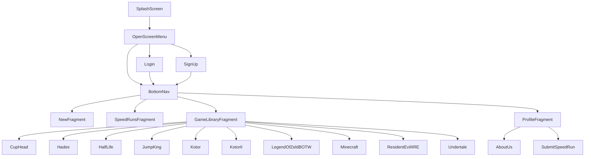

# GuideRunner

GuideRunner nevő projekt mobil alkalmazása.
Készítette: Deli Gábor

Admin jogosultság elérése és az adatok megváltoztatása csak webes oldalról lehetséges.

Backend:
https://github.com/paltsm/guiderunner

# Leírás:

Ez a dokumentáció egy a Java nyelven írott, Android Studióban kíszett mobil alkalmazás dokumentálását hivatott bemutatni.

# A projekt felépülése: 
  * Projekt sablonja (template) empty activity-re épül rá.
  * Target API : 31 ( A megcélzott API-szint azt jelzi, hogy az alkalmazás hogyan fut a	eltérő Android-verziókon.)
  * CompileSdk: 33 ( Megadja azt az API-szintet, amelyre a projektet le kell fordítani.)
  * MinSdk: 26
  * TargetSdk: 33
  
## Implementációk:
    ...
    ..
     'androidx.gridlayout:gridlayout:1.0.0'
       // Az Android GridLayout az elemek és nézetek téglalap alakú rács formájában történő megjelenítésére szolgál.
     
     'androidx.appcompat:appcompat:1.6.1'
      // Android-támogatási könyvtár, amely lehetővé teszi az ActionBar és a Material Design specifikus megvalósítását, 
      például az Eszköztár használatát a régebbi eszközökön egészen az Android v2-ig.
     
     'com.google.android.material:material:1.8.0'
      // Az Material Design átfogó útmutató a vizuális, mozgási és interakciós tervezéshez platformokon és eszközökön keresztül.
     
     'androidx.constraintlayout:constraintlayout:2.1.4'
      // A Layout Editor megszorítások segítségével határozza meg a felhasználói felület elemeinek helyzetét az elrendezésen belül.
      
     'com.airbnb.android:lottie:4.1.0'
      // Ez az implementáció az animációk használatát teszi lehetővé. 
      
     'androidx.cardview:cardview:1.0.0'
      // A CardView tárolókat gyakran listákban használják az egyes elemek információinak tárolására.
     
     'com.google.code.gson:gson:2.10'
      // A Gson egy Java-könyvtár, amely Java-objektumok JSON-reprezentációjukká alakítására használható. 
      Használható egy JSON karakterlánc egyenértékű Java objektummá konvertálására is.
    ..
    ...
    
## Activity-k/Osztályok/Fragmentek leírása:

### Activity-k(az itt nem található activity-ket a screenshot-oknál vannak részletezve):

| Fájlok | Leírás |
| ------------- | ------------- |
| RefreshScreen  | Egy SplashScreen, amelyet a News fragmenten lévő gombbal tudok aktiválni | 
| CupHead  | A GameLibrary fragmenten megjelenített játék | 
| Hades  | A GameLibrary fragmenten megjelenített játék | 
| HalfLife  | A GameLibrary fragmenten megjelenített játék | 
| HollowKnight  | A GameLibrary fragmenten megjelenített játék | 
| JumpKing  | A GameLibrary fragmenten megjelenített játék | 
| Kotor  | A GameLibrary fragmenten megjelenített játék | 
| KotorII  | A GameLibrary fragmenten megjelenített játék | 
| LegendOfZeldBOTW  | A GameLibrary fragmenten megjelenített játék | 
| Minecraft  | A GameLibrary fragmenten megjelenített játék | 
| ResidentEvilIIRE  | A GameLibrary fragmenten megjelenített játék | 
| Undertale  | A GameLibrary fragmenten megjelenített játék |  

### Osztályok:

| Fájlok | Leírás |
| ------------- | ------------- |
| LocalHelper  | A mező nem maradhat üresen | 
| Loginhelper  | Bejelentkezéshez használt segéd osztály | 
| LogOutHelper  | Kijelentkezéshez használt segéd osztály | 
| News  | A hírek lekérésére használt segéd osztály | 
| NewsLisHelper  | A hírek lekérésére használt segéd osztály  | 
| Records  | A SpeedRun-ok lekérésére használt segéd osztály  | 
| RequestHandler  | A kapcsolat létrehozásához(Backend és Frontend összekötése) szükséges segéd osztály | 
| Response  | A kapcsolat létrehozásához(Backend és Frontend összekötése) szükséges segéd osztály | 
| TokenHelper  | Bejelentkezéshez szükséges token mentésére használt segéd osztály | 
| Users  | Regisztrációhoz használt segéd osztály | 
| CustomizedExpandableListAdapter  | Az 'Add SpeedRun' activity-léve lenyítható listviewjoz használt segéd osztály | 
| ExpandableListDataItems  | Az 'Add SpeedRun' activity-léve lenyítható listviewjoz használt segéd osztály | 
| LocalHelper  | Az 'Add SpeedRun' activity-léve lenyítható listviewjoz használt segéd osztály | 

### Fragmentek:

| Fájlok | Leírás |
| ------------- | ------------- |
| NewsFragment  | Hírek megtekintése | 
| SpeedRunsFragment  | SpeedRun-ok megtekintése | 
| GameLibraryFragment  | játékok megtekintése | 
| ProfileFragment  | Egyéb lehetősegek megtekintese(1) | 

# Alkalmazás felépítése diagrammal:

# Alkalmazás felépítése felhasználok számára:

## Töltő képernyő

## Nyitó képernyő
### A felhasználó itt döntheti el, hogy regsztrálni vagy bejelentkezni szeretne. 
Viszont ha pedig egyiket se szeretné akkor erre van a 'Skip' gomb.(A funkciók korlátozva vannak,mint például a SpeedRun-ok hozzáadása) 

## Regisztráció
### A felhasználó itt regisztrálhat.

## Bejelentkezés
### A felhasználó itt jelentkezhet be.

## News
### A felhasználó itt nézheti a játékokkal kapcsolatos híreket.

## SpeedRuns
### A felhasználó itt nézheti meg az áltála vagy más játékosok áltál feltöltött SpeedRun-okat.

## Játék könytár
### A felhasználó itt nézheti az adminok által közétett játékokat.

## Profil(1)
### A felhasználó itt éri el az alább lehetőségeket: 
#### Kijelentkezés, Fiók törlése, SpeedRun hozzáadása, Elérhetőségek és alkalmazás információk

  
## Speedrun hozzáadása
### A felhasználó itt képes hozzádani SpeedRun-okat.

## About Us
### A felhasználó itt képes megtekinteni az alkotók elérhetőségit és az alkalmazás információit.

## Fiók törlése
### A felhasználó itt képes törölni a fiókját. 

## Kijelentkezés
### A felhasználó itt képes kijelentkezni.

